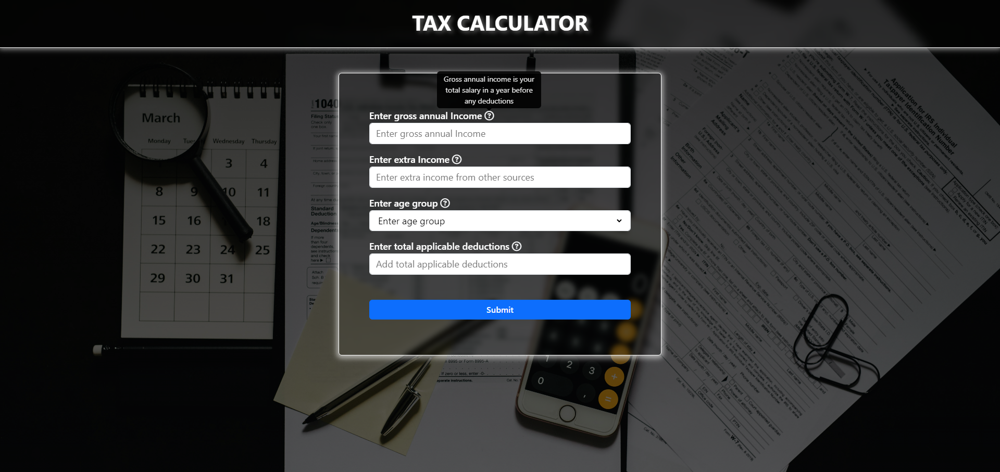
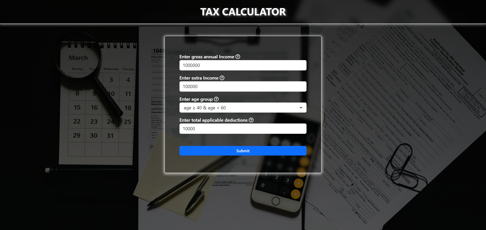

# Tax Calculator

## Overview
The Tax Calculator is a web application that helps users calculate their overall income after tax deductions. It's built using HTML, CSS, and JavaScript, with Bootstrap for styling.

## Features
- Allows users to input their gross annual income, extra income, age group, and applicable deductions.
- Automatically calculates the overall income after tax deductions based on the provided inputs.
- Provides error messages for invalid or empty input fields to ensure accurate calculations.
- Displays all values in Indian Rupees (INR) for user convenience.

## Tax Rates
- **Under 40 Years**: 30% tax on taxable income exceeding 8 lakhs.
- **40 to 60 Years**: 40% tax on taxable income exceeding 8 lakhs.
- **Over 60 Years**: 10% tax on taxable income exceeding 8 lakhs.

## How to Use
1. Visit the live version of the Tax Calculator: [Live Link](https://yourwebapp.com)
2. Enter your gross annual income, extra income, select your age group, and add applicable deductions.
3. Click on the "Submit" button to calculate your overall income after tax deductions.
4. View the result in the modal window.

## Screenshots

## Local Setup
To run the Tax Calculator locally on your machine:
1. Clone this GitHub repository:
2. Open the project directory in your code editor.
3. Open the `index.html` file in your web browser.

## Feedback
If you have any feedback or suggestions, please feel free to or [reach out to me](mailto:anujchaudhary3112@gmail.com).

